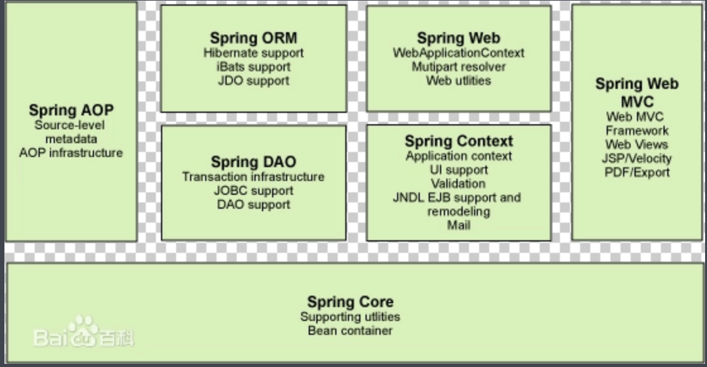
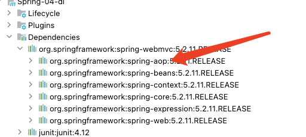

# **1、Spring**

## **1.1 简介**

* spring：春天

2002, 首次推出Spring的雏形interface21框架。

Spring框架是一个[开放源代码](https://baike.baidu.com/item/开放源代码/114160)的[J2EE](https://baike.baidu.com/item/J2EE/110838)应用程序框架，由[Rod Johnson](https://baike.baidu.com/item/Rod Johnson/1423612)发起，是针对bean的生命周期进行管理的轻量级容器（lightweight container）

spring目的：解决企业应用开发的复杂性

SSH:Strut2+Spring+Hibernate!

SSM:SpingMVC+Spring+Mybatics!

```xml
<!-- https://mvnrepository.com/artifact/org.springframework/spring-webmvc -->
<dependency>
    <groupId>org.springframework</groupId>
    <artifactId>spring-webmvc</artifactId>
    <version>5.2.11.RELEASE</version>
</dependency>

<!-- https://mvnrepository.com/artifact/org.springframework/spring-webmvc -->
<dependency>
    <groupId>org.springframework</groupId>
    <artifactId>spring-jdbc</artifactId>
    <version>5.2.11.RELEASE</version>
</dependency>

```

## **1.2 优点**

Spring是一个开源的免费的框架！

Spring 是一个轻量级的、非入侵式的框架

控制反转**IOC**（Inversion of Control），面向切面编程（**AOP**）Aspect Oriented Programming！

支持事务的处理，对框架整合的支持！

**总结：Spring就是一个轻量级的控制反转和面向编程的框架！**

## **1.3组成**



组成 Spring 框架的每个模块（或组件）都可以单独存在，或者与其他一个或多个模块联合实现。每个模块的功能如下：

**核心容器**：核心容器提供 Spring 框架的基本功能。核心容器的主要组件是 BeanFactory，它是工厂模式的实现。BeanFactory 使用控制反转（IOC） 模式将应用程序的配置和依赖性规范与实际的应用程序代码分开。
**Spring 上下文**：Spring 上下文是一个配置文件，向 Spring 框架提供上下文信息。Spring 上下文包括企业服务，例如 JNDI、EJB、电子邮件、国际化、校验和调度功能。
Spring AOP：通过配置管理特性，Spring AOP 模块直接将面向切面的编程功能 , 集成到了 Spring 框架中。所以，可以很容易地使 Spring 框架管理任何支持 AOP的对象。Spring AOP 模块为基于 Spring 的应用程序中的对象提供了事务管理服务。通过使用 Spring AOP，不用依赖组件，就可以将声明性事务管理集成到应用程序中。
**Spring DAO**：JDBC DAO 抽象层提供了有意义的异常层次结构，可用该结构来管理异常处理和不同数据库供应商抛出的错误消息。异常层次结构简化了错误处理，并且极大地降低了需要编写的异常代码数量（例如打开和关闭连接）。Spring DAO 的面向 JDBC 的异常遵从通用的 DAO 异常层次结构。
**Spring ORM**：Spring 框架插入了若干个 ORM 框架，从而提供了 ORM 的对象关系工具，其中包括 JDO、Hibernate 和 iBatis SQL Map。所有这些都遵从 Spring 的通用事务和 DAO 异常层次结构。
**Spring Web 模块**：Web 上下文模块建立在应用程序上下文模块之上，为基于 Web 的应用程序提供了上下文。所以，Spring 框架支持与 Jakarta Struts 的集成。Web 模块还简化了处理多部分请求以及将请求参数绑定到域对象的工作。
**Spring MVC 框架**：MVC 框架是一个全功能的构建 Web 应用程序的 MVC 实现。通过策略接口，MVC 框架变成为高度可配置的，MVC 容纳了大量视图技术，其中包括 JSP、Velocity、Tiles、iText 和 POI。

## **1.4 拓展**


**Spring Boot**

一个快速开发的脚手架

基于SpringBoot可以快速的开发单个微服务

**Spring Cloud**

Spring cloud是基于SpringBoot实现的

弊端：配置繁琐

# 2、IOC理论推导

## 2.1 IOC基础

1、UserDao接口

2、UserDaoImpl实现类

3、UserService业务接口

4、UserServiceImpl业务实现类

在我们之前的业务中，用户的需求可能会影响我们原来的代码，我们需要根据用户的需求修改代码！如果程序代码量十分大，修改一次的成本价十分昂贵！

那么我们要使用Oracle , 又需要去service实现类里面修改对应的实现 . 假设我们的这种需求非常大 , 这种方式就根本不适用了, 甚至反人类对吧 , 每次变动 , 都需要修改大量代码 . 这种设计的耦合性太高了, 牵一发而动全

我们使用一个Set接口实现，已经发生了革命性的变化！

**那我们如何去解决呢 ?**

我们可以在需要用到他的地方 , 不去实现它 , 而是留出一个接口 , 利用set , 我们去代码里修改下 

```java
  public class UserServiceImpl implements UserService {

   private UserDao userDao;
// 利用set实现
   public void setUserDao(UserDao userDao) {
       this.userDao = userDao;
  }

   @Override
   public void getUser() {
       userDao.getUser();
  }
}                  
```

​         现在去我们的测试类里 , 进行测试 ;

```java
@Test
public void test(){
   UserServiceImpl service = new UserServiceImpl();
   service.setUserDao( new UserDaoMySqlImpl() );
   service.getUser();
   //那我们现在又想用Oracle去实现呢
   service.setUserDao( new UserDaoOracleImpl() );
   service.getUser();
}
```

之前，程序是主动创建对象！控制权在程序员手上！

大家发现了区别没有 ? 可能很多人说没啥区别 . 但是同学们 , 他们已经发生了根本性的变化 , 很多地方都不一样了 . 仔细去思考一下 , 以前所有东西都是由程序去进行控制创建 , 而现在是由我们自行控制创建对象 , 把主动权交给了调用者 . 程序不用去管怎么创建,怎么实现了 . 它只负责提供一个接口 .

这种思想 , 从本质上解决了问题 , 我们程序员不再去管理对象的创建了 , 更多的去关注业务的实现 . 耦合性大大降低 . 这也就是IOC的原型

## 2.2 IOC本质

**控制反转IoC(Inversion of Control)，是一种设计思想，DI(依赖注入)是实现IoC的一种方法，也有人认为DI只是IoC的另一种说法。**没有IoC的程序中 , 我们使用面向对象编程 , 对象的创建与对象间的依赖关系完全硬编码在程序中，对象的创建由程序自己控制，控制反转后将对象的创建转移给第三方，个人认为所谓控制反转就是：获得依赖对象的方式反转了。


IoC是Spring框架的核心内容，使用多种方式完美的实现了IoC，可以使用XML配置，也可以使用注解，新版本的Spring也可以零配置实现IoC。

Spring容器在初始化时先读取配置文件，根据配置文件或元数据创建与组织对象存入容器中，程序使用时再从Ioc容器中取出需要的对象。


采用XML方式配置Bean的时候，Bean的定义信息是和实现分离的，而采用注解的方式可以把两者合为一体，Bean的定义信息直接以注解的形式定义在实现类中，从而达到了零配置的目的。

**控制反转是一种通过描述（XML或注解）并通过第三方去生产或获取特定对象的方式。在Spring中实现控制反转的是IoC容器，其实现方法是依赖注入（Dependency Injection,DI）。**

上一期中我们理解了IOC的基本思想，我们现在来看下Spring的应用：


# 3、HelloSpring

> 导入Jar包

注 : spring 需要导入commons-logging进行日志记录 . 我们利用maven , 他会自动下载对应的依赖项 .

```xml
<dependency>
   <groupId>org.springframework</groupId>
   <artifactId>spring-webmvc</artifactId>
   <version>5.1.10.RELEASE</version>
</dependency>
```

> 编写代码

1、编写一个Hello实体类

```java
public class Hello {
   private String name;

   public String getName() {
       return name;
  }
   public void setName(String name) {
       this.name = name;
  }

   public void show(){
       System.out.println("Hello,"+ name );
  }
}
```

2、编写我们的spring文件 , 这里我们命名为beans.xml

```java
<?xml version="1.0" encoding="UTF-8"?>
<beans xmlns="http://www.springframework.org/schema/beans"
      xmlns:xsi="http://www.w3.org/2001/XMLSchema-instance"
      xsi:schemaLocation="http://www.springframework.org/schema/beans
       http://www.springframework.org/schema/beans/spring-beans.xsd">

   <!--bean就是java对象 , 由Spring创建和管理-->
   <bean id="hello" class="com.kuang.pojo.Hello">
       <property name="name" value="Spring"/>
   </bean>

</beans>
```

3、我们可以去进行测试了 .

```java
@Test
public void test(){
   //解析beans.xml文件 , 生成管理相应的Bean对象
   ApplicationContext context = new ClassPathXmlApplicationContext("beans.xml");
   //getBean : 参数即为spring配置文件中bean的id .
   Hello hello = (Hello) context.getBean("hello");
   hello.show();
}
```

思考

Hello 对象是谁创建的 ? 【hello 对象是由Spring创建的】
Hello 对象的属性是怎么设置的 ? hello 对象的属性是由Spring容器设置的
这个过程就叫控制反转 :

* 控制 : 谁来控制对象的创建 , 传统应用程序的对象是由程序本身控制创建的 , 使用Spring后 , 对象是由Spring来创建的
* 反转 : 程序本身不创建对象 , 而变成被动的接收对象 .
  依赖注入 : 就是利用set方法来进行注入的.

IOC是一种编程思想，由主动的编程变成被动的接收

可以通过newClassPathXmlApplicationContext去浏览一下底层源码 .

修改案例一


我们在案例一中， 新增一个Spring配置文件beans.xml

```xml
<?xml version="1.0" encoding="UTF-8"?>
<beans xmlns="http://www.springframework.org/schema/beans"
      xmlns:xsi="http://www.w3.org/2001/XMLSchema-instance"
      xsi:schemaLocation="http://www.springframework.org/schema/beans
       http://www.springframework.org/schema/beans/spring-beans.xsd">

   <bean id="MysqlImpl" class="com.kuang.dao.impl.UserDaoMySqlImpl"/>
   <bean id="OracleImpl" class="com.kuang.dao.impl.UserDaoOracleImpl"/>

   <bean id="ServiceImpl" class="com.kuang.service.impl.UserServiceImpl">
       <!--注意: 这里的name并不是属性 , 而是set方法后面的那部分 , 首字母小写-->
       <!--引用另外一个bean , 不是用value 而是用 ref-->
       <property name="userDao" ref="OracleImpl"/>
   </bean>

</beans>
```

测试

```Java
@Test
public void test2(){
   ApplicationContext context = new ClassPathXmlApplicationContext("beans.xml");
   UserServiceImpl serviceImpl = (UserServiceImpl) context.getBean("ServiceImpl");
   serviceImpl.getUser();
}
```

**OK , 到了现在 , 我们彻底不用再程序中去改动了 , 要实现不同的操作 , 只需要在xml配置文件中进行修改 , 所谓的IoC,一句话搞定 : 对象由Spring 来创建 , 管理 , 装配 !**

# 4、IOC创建对象方式

## 4.1 通过无参构造方法来创建

1、User.java

```java
public class User {

   private String name;

   public User() {
       System.out.println("user无参构造方法");
  }

   public void setName(String name) {
       this.name = name;
  }

   public void show(){
       System.out.println("name="+ name );
  }

}
```

2、beans.xml

```xml
<?xml version="1.0" encoding="UTF-8"?>
<beans xmlns="http://www.springframework.org/schema/beans"
      xmlns:xsi="http://www.w3.org/2001/XMLSchema-instance"
      xsi:schemaLocation="http://www.springframework.org/schema/beans
       http://www.springframework.org/schema/beans/spring-beans.xsd">

   <bean id="user" class="com.kuang.pojo.User">
       <property name="name" value="kuangshen"/>
   </bean>

</beans>
```

3、测试类

```java
@Test
public void test(){
   ApplicationContext context = new ClassPathXmlApplicationContext("beans.xml");
   //在执行getBean的时候, user已经创建好了 , 通过无参构造
   User user = (User) context.getBean("user");
   //调用对象的方法 .
   user.show();
}
```


结果可以发现，在调用show方法之前，User对象已经通过无参构造初始化了！

## 4.2 通过有参构造方法来创建

1、UserT . java

```java
public class UserT {

   private String name;

   public UserT(String name) {
       this.name = name;
  }

   public void setName(String name) {
       this.name = name;
  }

   public void show(){
       System.out.println("name="+ name );
  }

}
```

2、beans.xml 有三种方式编写

```xml
<!-- 第一种根据index参数下标设置 -->
<bean id="userT" class="com.kuang.pojo.UserT">
   <!-- index指构造方法 , 下标从0开始 -->
   <constructor-arg index="0" value="kuangshen2"/>
</bean>
<!-- 第二种根据参数名字设置 -->
<bean id="userT" class="com.kuang.pojo.UserT">
   <!-- name指参数名 -->
   <constructor-arg name="name" value="kuangshen2"/>
</bean>
<!-- 第三种根据参数类型设置 -->
<bean id="userT" class="com.kuang.pojo.UserT">
   <constructor-arg type="java.lang.String" value="kuangshen2"/>
</bean>
```

3、测试

```java
@Test
public void testT(){
   ApplicationContext context = new ClassPathXmlApplicationContext("beans.xml");
   UserT user = (UserT) context.getBean("userT");
   user.show();
}
```

结论：在配置文件加载的时候。其中管理的对象都已经初始化了！

# 5、Spring配置

别名

alias 设置别名 , 为bean设置别名 , 可以设置多个别名

```xml
<!--设置别名：在获取Bean的时候可以使用别名获取-->
<alias name="userT" alias="userNew"/>
```


Bean的配置

```xml
<!--bean就是java对象,由Spring创建和管理-->

<!--
   id 是bean的标识符,要唯一,如果没有配置id,name就是默认标识符
   如果配置id,又配置了name,那么name是别名
   name可以设置多个别名,可以用逗号,分号,空格隔开
   如果不配置id和name,可以根据applicationContext.getBean(.class)获取对象;

class是bean的全限定名=包名+类名
-->
<bean id="hello" name="hello2 h2,h3;h4" class="com.kuang.pojo.Hello">
   <property name="name" value="Spring"/>
</bean>
```

import

团队的合作通过import来实现 .

```xml
<import resource="{path}/beans.xml"/>
```

# 6、依赖注入

概念

1. 依赖注入（Dependency Injection,DI）。
2. 依赖 : 指Bean对象的创建依赖于容器 . Bean对象的依赖资源 .
3. 注入 : 指Bean对象所依赖的资源 , 由容器来设置和装配 。

## 6.1、构造器注入

  

## 6.2、Set注入（重点）

* 依赖注入：set注入！
  *  依赖：bean对象的创建依赖于容器！
  * 注入：bean对象中的所有属性，由容器来注入！

要求被注入的属性 , 必须有set方法 , set方法的方法名由set + 属性首字母大写 , 如果属性是boolean类型 , 没有set方法 , 是 is .


<1.复杂类型>

测试pojo类 :

Address.java

```java
public class Address {
    private String address;

    public String getAddress() {
        return address;
    }

    public void setAddress(String address) {
        this.address = address;
    }

    @Override
    public String toString() {
        return "Address{" +
                "address='" + address + '\'' +
                '}';
    }
}
```

beans.xml

```xml
 <bean id="address" class="com.boar.pojo.Address">
        <property name="address" value="西安"></property>
    </bean>

    <bean id="student" class="com.boar.pojo.Student">
        <!-- 第一种：普通值注入： value-->
    <property name="name" value="野猪"></property>
        <!--第二种： bean注入： ref-->
    <property name="address" ref="address"></property>
        <!--第三种： 数组注入： ref-->
        <property name="books" >
            <array>
                <value>红楼梦</value>
                <value>西游记</value>
                <value>三国演义</value>
                <value>水浒传</value>
            </array>
        </property>
        <!--第四种： list注入： ref-->
        <property name="hobbys">
            <list>
                <value>听歌</value>
                <value>爬山</value>
                <value>看电影</value>
            </list>
        </property>
        <!--第五种： map注入： ref-->
        <property name="card">
            <map>
                <entry key="身份证" value="199745452336"></entry>
                <entry key="银行卡" value="15645642314512"></entry>
            </map>
        </property>
        <!--第六种： set注入： ref-->
        <property name="games">
            <set>
                <value>loc</value>
                <value>glorty of king</value>
            </set>
        </property>
        <!--第七种： null注入： ref-->
        <property name="wife"><null/>
        </property>
        <!--第七种： properti注入： ref-->
        <property name="info">
            <props>
                <prop key="drive">15662</prop>
                <prop key="url">男</prop>
                <prop key="username">李健</prop>
                <prop key="password">123456</prop>
            </props>
        </property>

    </bean>
```

测试类

```java
public class Mytest {
    public static void main(String[] args) {
        ApplicationContext context = new ClassPathXmlApplicationContext("beans.xml");
        Student student = (Student) context.getBean("student");
        System.out.println(student.toString());
        //Student{name='野猪', address=Address{address='西安'},
        // books=[红楼梦, 西游记, 三国演义, 水浒传], hobbys=[听歌, 爬山, 看电影],
        // card={身份证=199745452336, 银行卡=15645642314512}, games=[loc, glorty of king],
        // wife='null', info={password=123456, drive=15662, url=男, username=李健}}
    }
}

```

## 6.3 、拓展方式注入

我们可以通过P命名空间和C命名空间进行注入。

```xml
<?xml version="1.0" encoding="UTF-8"?>
<beans xmlns="http://www.springframework.org/schema/beans"
       xmlns:xsi="http://www.w3.org/2001/XMLSchema-instance"
       xmlns:context="http://www.springframework.org/schema/context"
       xmlns:p="http://www.springframework.org/schema/p"
       xmlns:c="http://www.springframework.org/schema/c"
       xsi:schemaLocation="http://www.springframework.org/schema/beans
        https://www.springframework.org/schema/beans/spring-beans.xsd http://www.springframework.org/schema/context https://www.springframework.org/schema/context/spring-context.xsd">
    <!-- collaborators and configuration for this bean go here -->
    <!--  p命名空间注入，可以直接注入属性的值：property  -->
    <bean id="user" class="com.boar.pojo.User" p:name="野猪" p:age="25"></bean>
    <!--  c命名空间注入，通过构造器注入：construct-args -->
   <bean id="user2" class="com.boar.pojo.User" c:age="25" c:name="boar"></bean>
    
</beans>
```

测试

```
    @Test
        public void test2(){
            ApplicationContext context = new ClassPathXmlApplicationContext("userbean.xml");
              User user = context.getBean("user2", User.class);
            System.out.println(user);
        }

```

注意点：P命名和C命名空间需要导入约束！

```xml
 xmlns:p="http://www.springframework.org/schema/p"
 xmlns:c="http://www.springframework.org/schema/c"
```

## 6.4、Bean的作用域


1、单例模式（Spring的默认机制）

```xml
    <bean id="user" class="com.boar.pojo.User" p:name="野猪" p:age="25" scope="singleton"></bean>
```

2.原型模式（每次从容器中get的时候，都会产生一个新对象！）


```xml
<bean id="accountService" class="com.something.DefaultAccountService" scope="prototype"/>
```

3.其余的request、session、application、这些个只能在web开发中使用到！

# 7、自动装配说明

自动装配是使用spring满足bean依赖的一种方法

* spring会在应用上下文中为某个bean寻找其依赖的bean。
* Spring中bean有三种装配机制，分别是：

1、在xml中显式配置；
2、在java中显式配置；
3、隐式的bean发现机制和自动装配。
这里我们主要讲第三种：自动化的装配bean。

Spring的自动装配需要从两个角度来实现，或者说是两个操作：

1、组件扫描(component scanning)：spring会自动发现应用上下文中所创建的bean；
2、自动装配(autowiring)：spring自动满足bean之间的依赖，也就是我们说的IoC/DI；

组件扫描和自动装配组合发挥巨大威力，使得显示的配置降低到最少。

**推荐不使用自动装配xml配置 , 而使用注解 .**

## 7.1、测试环境搭建

1、新建一个项目

2、新建两个实体类，Cat Dog 都有一个叫的方法

```java
public class Cat {
   public void shout() {
       System.out.println("miao~");
  }
}
public class Dog {
   public void shout() {
       System.out.println("wang~");
  }
}
```

3、新建一个用户类 User

```
public class User {
   private Cat cat;
   private Dog dog;
   private String str;
}

```

4、编写Spring配置文件

```
<?xml version="1.0" encoding="UTF-8"?>
<beans xmlns="http://www.springframework.org/schema/beans"
      xmlns:xsi="http://www.w3.org/2001/XMLSchema-instance"
      xsi:schemaLocation="http://www.springframework.org/schema/beans
       http://www.springframework.org/schema/beans/spring-beans.xsd">

   <bean id="dog" class="com.kuang.pojo.Dog"/>
   <bean id="cat" class="com.kuang.pojo.Cat"/>

   <bean id="user" class="com.kuang.pojo.User">
       <property name="cat" ref="cat"/>
       <property name="dog" ref="dog"/>
       <property name="str" value="qinjiang"/>
   </bean>
</beans>

```

5、测试

```
public class MyTest {
   @Test
   public void testMethodAutowire() {
       ApplicationContext context = new ClassPathXmlApplicationContext("beans.xml");
       User user = (User) context.getBean("user");
       user.getCat().shout();
       user.getDog().shout();
  }
}

```

结果正常输出，环境OK

## 7.2、byName

autowire byName (按名称自动装配)

由于在手动配置xml过程中，常常发生字母缺漏和大小写等错误，而无法对其进行检查，使得开发效率降低。

采用自动装配将避免这些错误，并且使配置简单化。

测试：

1、修改bean配置，增加一个属性 autowire=“byName”

```java
<bean id="user" class="com.kuang.pojo.User" autowire="byName">
   <property name="str" value="qinjiang"/>
</bean>
```

2、再次测试，结果依旧成功输出！

3、我们将 cat 的bean id修改为 catXXX

4、再次测试， 执行时报空指针java.lang.NullPointerException。因为按byName规则找不对应set方法，真正的setCat就没执行，对象就没有初始化，所以调用时就会报空指针错误。

小结：

* 当一个bean节点带有 autowire byName的属性时。

* 将查找其类中所有的set方法名，例如setCat，获得将set去掉并且首字母小写的字符串，即cat。

去spring容器中寻找是否有此字符串名称id的对象。

如果有，就取出注入；如果没有，就报空指针异常。


## 7.3、byType

autowire byType (按类型自动装配)

使用autowire byType首先需要保证：同一类型的对象，在spring容器中唯一。如果不唯一，会报不唯一的异常。

NoUniqueBeanDefinitionException
1
测试：

1、将user的bean配置修改一下 ： autowire=“byType”

2、测试，正常输出

3、在注册一个cat 的bean对象！

```xml
<bean id="dog" class="com.kuang.pojo.Dog"/>
<bean id="cat" class="com.kuang.pojo.Cat"/>
<bean id="cat2" class="com.kuang.pojo.Cat"/>

<bean id="user" class="com.kuang.pojo.User" autowire="byType">
   <property name="str" value="qinjiang"/>
</bean>
```

4、测试，报错：NoUniqueBeanDefinitionException

5、删掉cat2，将cat的bean名称改掉！测试！因为是按类型装配，所以并不会报异常，也不影响最后的结果。甚至将id属性去掉，也不影响结果。

这就是按照类型自动装配！

使用注解

## 7.4、使用注解

jdk1.5开始支持注解，spring2.5开始全面支持注解。

准备工作：利用注解的方式注入属性。

1、在spring配置文件中引入context文件头

```xml
xmlns:context="http://www.springframework.org/schema/context"

http://www.springframework.org/schema/context
http://www.springframework.org/schema/context/spring-context.xsd
```

2、**开启属性注解支持！**

```xml
<context:annotation-config/>
```

## 7.5、@Autowired

@Autowired是按类型自动转配的，不支持id匹配。
需要导入 spring-aop的包！
测试：

1、**将User**类中的set方法去掉****，，前提是你这个自动装配的属性在IOC容器中存在，且符合名字Byname

使用@Autowired注解

```java
public class User {
   @Autowired
   private Cat cat;
   @Autowired
   private Dog dog;
   private String str;

   public Cat getCat() {
       return cat;
  }
   public Dog getDog() {
       return dog;
  }
   public String getStr() {
       return str;
  }
}
```


2、此时配置文件内容

```xml
context:annotation-config/>

<bean id="dog" class="com.kuang.pojo.Dog"/>
<bean id="cat" class="com.kuang.pojo.Cat"/>
<bean id="user" class="com.kuang.pojo.User"/>
```

3、测试，成功输出结果！

【小狂神科普时间】

```xml
@Nulllabel 字段标记了这个注解，说明这个字段可以为Null
@Autowired(required=false) 说明：false，对象可以为null；true，对象必须存对象，不能为null。

//如果允许对象为null，设置required = false,默认为true
@Autowired(required = false)
private Cat cat;
```

## 7.6、@Qualifier

@Autowired是根据类型自动装配的，加上@Qualifier则可以根据byName的方式自动装配
@Qualifier不能单独使用。

测试实验步骤：

1、配置文件修改内容，保证类型存在对象。且名字不为类的默认名字！

```xml
<bean id="dog1" class="com.kuang.pojo.Dog"/>
<bean id="dog2" class="com.kuang.pojo.Dog"/>
<bean id="cat1" class="com.kuang.pojo.Cat"/>
<bean id="cat2" class="com.kuang.pojo.Cat"/>
2、没有加Qualifier测试，直接报错
```

3、在属性上添加Qualifier注解

```xml
@Autowired
@Qualifier(value = "cat2")
private Cat cat;
@Autowired
@Qualifier(value = "dog2")
private Dog dog;
测试，成功输出！
```

## 7.7、@Resource

@Resource如有指定的name属性，先按该属性进行byName方式查找装配；
其次再进行默认的byName方式进行装配；
如果以上都不成功，则按byType的方式自动装配。
都不成功，则报异常。
实体类：

```java
public class User {
   //如果允许对象为null，设置required = false,默认为true
   @Resource(name = "cat2")
   private Cat cat;
   @Resource
   private Dog dog;
   private String str;
}
```


beans.xml

```xml
<bean id="dog" class="com.kuang.pojo.Dog"/>
<bean id="cat1" class="com.kuang.pojo.Cat"/>
<bean id="cat2" class="com.kuang.pojo.Cat"/>

<bean id="user" class="com.kuang.pojo.User"/>
```


测试：结果OK

配置文件2：beans.xml ， 删掉cat2

```xml
<bean id="dog" class="com.kuang.pojo.Dog"/>
<bean id="cat1" class="com.kuang.pojo.Cat"/>
```


实体类上只保留注解

```xml
@Resource
private Cat cat;
@Resource
private Dog dog;
```


结果：OK

结论：先进行byName查找，失败；再进行byType查找，成功。

小结
@Autowired与@Resource异同：

1、@Autowired与@Resource都可以用来自动装配bean。都可以写在字段上，或写在setter方法上。

2、@Autowired默认按类型装配（属于spring规范），默认情况下必须要求依赖对象必须存在，如果要允许null 值，可以设置它的required属性为false，如：@Autowired(required=false) ，如果我们想使用名称装配可以结合@Qualifier注解进行使用

3、@Resource（属于J2EE复返），默认按照名称进行装配，名称可以通过name属性进行指定。如果没有指定name属性，当注解写在字段上时，默认取字段名进行按照名称查找，如果注解写在setter方法上默认取属性名进行装配。当找不到与名称匹配的bean时才按照类型进行装配。但是需要注意的是，如果name属性一旦指定，就只会按照名称进行装配。

它们的作用相同都是用注解方式注入对象，**但执行顺序不同**。@Autowired先byType，@Resource先byName。

# 8、使用注解开发

## 8.1、说明

在spring4之后，想要使用注解形式，必须得要引入aop的包



在配置文件当中，还得要引入一个context约束

```xml
<?xml version="1.0" encoding="UTF-8"?>
<beans xmlns="http://www.springframework.org/schema/beans"
      xmlns:xsi="http://www.w3.org/2001/XMLSchema-instance"
      xmlns:context="http://www.springframework.org/schema/context"
      xsi:schemaLocation="http://www.springframework.org/schema/beans
       http://www.springframework.org/schema/beans/spring-beans.xsd
       http://www.springframework.org/schema/context
       http://www.springframework.org/schema/context/spring-context.xsd">

</beans>
```

## 8.2、Bean的实现

我们之前都是使用 bean 的标签进行bean注入，但是实际开发中，我们一般都会使用注解！

1、配置扫描哪些包下的注解

```xml
<!--指定注解扫描包-->
<context:component-scan base-package="com.kuang.pojo"/>
```

2、在指定包下编写类，增加注解

```xml
@Component("user")
// 相当于配置文件中 <bean id="user" class="当前注解的类"/>
public class User {
   public String name = "秦疆";
}
```


3、测试

```xml
@Test
public void test(){
   ApplicationContext applicationContext =
       new ClassPathXmlApplicationContext("beans.xml");
   User user = (User) applicationContext.getBean("user");
   System.out.println(user.name);
}
```

## 8.3、属性注入

使用注解注入属性

1、可以不用提供set方法，直接在直接名上添加@value(“值”)

```xml
@Component("user")
// 相当于配置文件中 <bean id="user" class="当前注解的类"/>
public class User {
   @Value("秦疆")
   // 相当于配置文件中 <property name="name" value="秦疆"/>
   public String name;
}
```


2、如果提供了set方法，在set方法上添加@value(“值”);

```xml
@Component("user")
public class User {

   public String name;

   @Value("秦疆")
   public void setName(String name) {
       this.name = name;
  }
}
```

衍生注解

我们这些注解，就是替代了在配置文件当中配置步骤而已！更加的方便快捷！

@Component三个衍生注解

为了更好的进行分层，Spring可以使用其它三个注解，功能一样，目前使用哪一个功能都一样。

@Controller：web层
@Service：service层
@Repository：dao层
这四个注解都是一样的，都是讲某个类注册到Spring中，装配到Bean中，写上这些注解，就相当于将这个类交给Spring管理装配了！

## 8.4、自动装配注解

在Bean的自动装配已经讲过了，可以回顾！

1、作用域

```xml
@scope

singleton：默认的，Spring会采用单例模式创建这个对象。关闭工厂 ，所有的对象都会销毁。
prototype：多例模式。关闭工厂 ，所有的对象不会销毁。内部的垃圾回收机制会回收
@Controller("user")
@Scope("prototype")
public class User {
   @Value("秦疆")
   public String name;
}
```


## 8.5、小结

XML与注解比较

XML可以适用任何场景 ，结构清晰，维护方便、维护相对困难！
注解不是自己提供的类使用不了，开发简单方便
**xml与注解整合开发 ：推荐最佳实践**

xml负责管理Bean，注解负责属性注入

xml管理Bean
注解完成属性注入
使用过程中， 可以不用扫描，扫描是为了类上的注解

```xml
<context:annotation-config/>  

```


作用：

进行注解驱动注册，从而使注解生效

用于激活那些已经在spring容器里注册过的bean上面的注解，也就是显示的向Spring注册

如果不扫描包，就需要手动配置bean

如果不加注解驱动，则注入的值为null！

8.6、基于Java类进行配置
JavaConfig 原来是 Spring 的一个子项目，它通过 Java 类的方式提供 Bean 的定义信息，在 Spring4 的版本， JavaConfig 已正式成为 Spring4 的核心功能 。

测试：

1、编写一个实体类，Dog

```java
@Component  //将这个类标注为Spring的一个组件，放到容器中！
public class Dog {
   public String name = "dog";
}
```


2、新建一个config配置包，编写一个MyConfig配置类

```java
@Configuration  //代表这是一个配置类
public class MyConfig {

   @Bean //通过方法注册一个bean，这里的返回值就Bean的类型，方法名就是bean的id！
   public Dog dog(){
       return new Dog();
  }

}
```


3、测试

```java
@Test
public void test2(){
   ApplicationContext applicationContext =
           new AnnotationConfigApplicationContext(MyConfig.class);
   Dog dog = (Dog) applicationContext.getBean("dog");
   System.out.println(dog.name);
}
```


4、成功输出结果！

导入其他配置如何做呢？

## 8.6、使用Java的方式配置Spring

Javaconfig是spring一个子项目

1、我们再编写一个配置类！

```java
@Configuration  //代表这是一个配置类
public class MyConfig2 {
}

```

2、在之前的配置类中我们来选择导入这个配置类

```java
@Configuration
@Import(MyConfig2.class)  //导入合并其他配置类，类似于配置文件中的 inculde 标签
public class MyConfig {

   @Bean
   public Dog dog(){
       return new Dog();
  }

}
```


关于这种Java类的配置方式，我们在之后的SpringBoot 和 SpringCloud中还会大量看到，我们需要知道这些注解的作用即可！

# 9、为什么要学习代理模式，因为AOP的底层机制就是动态代理！

代理模式：

静态代理
动态代理
学习aop之前 , 我们要先了解一下代理模式！

为什么要学习代理模式？因为这是SpringAOP的底层！【SpringAOP和SpringMVC】

## 9.1、静态代理


静态代理角色分析

抽象角色 : 一般使用接口或者抽象类来实现

真实角色 : 被代理的角色

代理角色 : 代理真实角色 ; 代理真实角色后 , 一般会做一些附属的操作 .

客户 : 使用代理角色来进行一些操作 .

代理模式的好处：

   * 可以是真实的操作更加纯粹！不用关注一些公共的业务

   * 公共也就交给代理角色！实现了业务的分工

   * 公共业务发生扩展的时候，方便集中管理！

     **缺点：**

   * 一个真实角色就会产生一个代理角色，代码量会翻倍-开发效率会变低

     

代码实现

Rent . java 即抽象角色

```java
//抽象角色：租房
public interface Rent {
   public void rent();
}
```


Host . java 即真实角色

```
//真实角色: 房东，房东要出租房子
public class Host implements Rent{
   public void rent() {
       System.out.println("房屋出租");
  }
}
```


Proxy . java 即代理角色

```
//代理角色：中介
public class Proxy implements Rent {

   private Host host;
   public Proxy() { }
   public Proxy(Host host) {
       this.host = host;
  }

   //租房
   public void rent(){
       seeHouse();
       host.rent();
       fare();
  }
   //看房
   public void seeHouse(){
       System.out.println("带房客看房");
  }
   //收中介费
   public void fare(){
       System.out.println("收中介费");
  }
}
```


Client . java 即客户

```
//客户类，一般客户都会去找代理！
public class Client {
   public static void main(String[] args) {
       //房东要租房
       Host host = new Host();
       //中介帮助房东
       Proxy proxy = new Proxy(host);

       //你去找中介！
       proxy.rent();

  }
}
```


分析：在这个过程中，你直接接触的就是中介，就如同现实生活中的样子，你看不到房东，但是你依旧租到了房东的房子通过代理，这就是所谓的代理模式，程序源自于生活，所以学编程的人，一般能够更加抽象的看待生活中发生的事情。

静态代理的好处:

可以使得我们的真实角色更加纯粹 . 不再去关注一些公共的事情 .
公共的业务由代理来完成 . 实现了业务的分工 ,
公共业务发生扩展时变得更加集中和方便 .
缺点 :

类多了 , 多了代理类 , 工作量变大了 . 开发效率降低 .
我们想要静态代理的好处，又不想要静态代理的缺点，所以 , 就有了动态代理 !

## 9.2、静态代理再理解

同学们练习完毕后，我们再来举一个例子，巩固大家的学习！

练习步骤：

1、创建一个抽象角色，比如咋们平时做的用户业务，抽象起来就是增删改查！

```
//抽象角色：增删改查业务
public interface UserService {
   void add();
   void delete();
   void update();
   void query();
}
```


2、我们需要一个真实对象来完成这些增删改查操作

```
//真实对象，完成增删改查操作的人
public class UserServiceImpl implements UserService {

   public void add() {
       System.out.println("增加了一个用户");
  }

   public void delete() {
       System.out.println("删除了一个用户");
  }

   public void update() {
       System.out.println("更新了一个用户");
  }

   public void query() {
       System.out.println("查询了一个用户");
  }
}
```


3、需求来了，现在我们需要增加一个日志功能，怎么实现！

思路1 ：在实现类上增加代码 【麻烦！】
思路2：使用代理来做，能够不改变原来的业务情况下，实现此功能就是最好的了！
4、设置一个代理类来处理日志！代理角色

```
//代理角色，在这里面增加日志的实现
public class UserServiceProxy implements UserService {
   private UserServiceImpl userService;

   public void setUserService(UserServiceImpl userService) {
       this.userService = userService;
  }

   public void add() {
       log("add");
       userService.add();
  }

   public void delete() {
       log("delete");
       userService.delete();
  }

   public void update() {
       log("update");
       userService.update();
  }

   public void query() {
       log("query");
       userService.query();
  }

   public void log(String msg){
       System.out.println("执行了"+msg+"方法");
  }

}
```


5、测试访问类：

```
public class Client {
   public static void main(String[] args) {
       //真实业务
       UserServiceImpl userService = new UserServiceImpl();
       //代理类
       UserServiceProxy proxy = new UserServiceProxy();
       //使用代理类实现日志功能！
       proxy.setUserService(userService);

       proxy.add();

  }
}
```


OK，到了现在代理模式大家应该都没有什么问题了，重点大家需要理解其中的思想；

我们在不改变原来的代码的情况下，实现了对原有功能的增强，这是AOP中最核心的思想

聊聊AOP：纵向开发，横向开发

## 9.3、动态代理

* 动态代理的角色和静态代理的角色一样 .

* 动态代理的代理类是动态生成的 . 静态代理的代理类是我们提前写好的

动态代理分为两类 : 一类是基于接口动态代理 , 一类是基于类的动态代理

* **基于接口**的动态代理----JDK动态代理
  * **基于类**的动态代理–cglib
  * **Java字节码：**现在用的比较多的是 javasist 来生成动态代理.，百度一下javasist
    我们这里使用JDK的原生代码来实现，其余的道理都是一样的！、
    JDK的动态代理需要了解两个类

核心 : InvocationHandler 和 Proxy 代理， 打开JDK帮助文档看看

【**InvocationHandler**：调用处理程序】


Object invoke(Object proxy, 方法 method, Object[] args)；

```
//参数
//proxy - 调用该方法的代理实例
//method -所述方法对应于调用代理实例上的接口方法的实例。方法对象的声明类将是该方法声明的接口，它可以是代理类继承该方法的代理接口的超级接口。
//args -包含的方法调用传递代理实例的参数值的对象的阵列，或null如果接口方法没有参数。原始类型的参数包含在适当的原始包装器类的实例中，例如java.lang.Integer或java.lang.Boolean 。
```


【Proxy : 代理】

```
//生成代理类
public Object getProxy(){
   return Proxy.newProxyInstance(this.getClass().getClassLoader(),
                                 rent.getClass().getInterfaces(),this);
}
```


代码实现

抽象角色和真实角色和之前的一样！

```java
Rent . java 即抽象角色

//抽象角色：租房
public interface Rent {
   public void rent();
}
```


Host . java 即真实角色

//真实角色: 房东，房东要出租房子

```java
public class Host implements Rent{
   public void rent() {
       System.out.println("房屋出租");
  }
}
```


ProxyInvocationHandler. java 即代理角色

```java
public class ProxyInvocationHandler implements InvocationHandler {
   private Rent rent;

   public void setRent(Rent rent) {
       this.rent = rent;
  }

   //生成代理类，重点是第二个参数，获取要代理的抽象角色！之前都是一个角色，现在可以代理一类角色
   public Object getProxy(){
       return Proxy.newProxyInstance(this.getClass().getClassLoader(),
               rent.getClass().getInterfaces(),this);
  }

   // proxy : 代理类 method : 代理类的调用处理程序的方法对象.
   // 处理代理实例上的方法调用并返回结果
   @Override
   public Object invoke(Object proxy, Method method, Object[] args) throws Throwable {
       seeHouse();
       //核心：本质利用反射实现！
       Object result = method.invoke(rent, args);
       fare();
       return result;
  }

   //看房
   public void seeHouse(){
       System.out.println("带房客看房");
  }
   //收中介费
   public void fare(){
       System.out.println("收中介费");
  }

}
```


Client . java

```java
//租客
public class Client {

   public static void main(String[] args) {
       //真实角色
       Host host = new Host();
       //代理实例的调用处理程序
       ProxyInvocationHandler pih = new ProxyInvocationHandler();
       pih.setRent(host); //将真实角色放置进去！
       Rent proxy = (Rent)pih.getProxy(); //动态生成对应的代理类！
       proxy.rent();
  }

}
```


核心：一个动态代理 , 一般代理某一类业务 , 一个动态代理可以代理多个类，代理的是接口！、

## 9.4、深化理解

我们来使用动态代理实现代理我们后面写的UserService！

我们也可以编写一个通用的动态代理实现的类！所有的代理对象设置为Object即可！

```java
public class ProxyInvocationHandler implements InvocationHandler {
   private Object target;

   public void setTarget(Object target) {
       this.target = target;
  }

   //生成代理类
   public Object getProxy(){
       return Proxy.newProxyInstance(this.getClass().getClassLoader(),
               target.getClass().getInterfaces(),this);
  }

   // proxy : 代理类
   // method : 代理类的调用处理程序的方法对象.
   public Object invoke(Object proxy, Method method, Object[] args) throws Throwable {
       log(method.getName());
       Object result = method.invoke(target, args);
       return result;
  }

   public void log(String methodName){
       System.out.println("执行了"+methodName+"方法");
  }

}
```

测试！

```java
public class Test {
   public static void main(String[] args) {
       //真实对象
       UserServiceImpl userService = new UserServiceImpl();
       //代理对象的调用处理程序
       ProxyInvocationHandler pih = new ProxyInvocationHandler();
       pih.setTarget(userService); //设置要代理的对象
       UserService proxy = (UserService)pih.getProxy(); //动态生成代理类！
       proxy.delete();
  }
}
```


测试，增删改查，查看结果！

1、动态代理的好处
静态代理有的它都有，静态代理没有的，它也有！

可以使得我们的真实角色更加纯粹 . 不再去关注一些公共的事情 .
公共的业务由代理来完成 . 实现了业务的分工 ,
公共业务发生扩展时变得更加集中和方便 .
一个动态代理 , 一般代理某一类业务
一个动态代理可以代理多个类，代理的是接口！

# 10、AOP就这么简单

上一讲中我们讲解了代理模式，这是AOP的基础，一定要先搞懂它

狂神说Spring06：静态/动态代理模式

那我们接下来就来聊聊AOP吧！

## 10.1、什么是AOP

AOP（Aspect Oriented Programming）意为：面向切面编程，通过预编译方式和运行期动态代理实现程序功能的统一维护的一种技术。AOP是OOP的延续，是软件开发中的一个热点，也是Spring框架中的一个重要内容，是函数式编程的一种衍生范型。利用AOP可以对业务逻辑的各个部分进行隔离，从而使得业务逻辑各部分之间的耦合度降低，提高程序的可重用性，同时提高了开发的效率。


Aop在Spring中的作用

提供声明式事务；允许用户自定义切面

以下名词需要了解下：

横切关注点：跨越应用程序多个模块的方法或功能。即是，与我们业务逻辑无关的，但是我们需要关注的部分，就是横切关注点。如日志 , 安全 , 缓存 , 事务等等 …
切面（ASPECT）：横切关注点 被模块化 的特殊对象。即，它是一个类。
通知（Advice）：切面必须要完成的工作。即，它是类中的一个方法。
目标（Target）：被通知对象。
代理（Proxy）：向目标对象应用通知之后创建的对象。
切入点（PointCut）：切面通知 执行的 “地点”的定义。
连接点（JointPoint）：与切入点匹配的执行点。


   SpringAOP中，通过Advice定义横切逻辑，Spring中支持5种类型的Advice:


即 Aop 在 不改变原有代码的情况下 , 去增加新的功能 .

## 10.2、使用Spring实现Aop

【重点】使用AOP织入，需要导入一个依赖包！

```xml
<!-- https://mvnrepository.com/artifact/org.aspectj/aspectjweaver -->
<dependency>
   <groupId>org.aspectj</groupId>
   <artifactId>aspectjweaver</artifactId>
   <version>1.9.4</version>
</dependency>
```


第一种方式

### 通过 **Spring API** 实现

首先编写我们的业务接口和实现类

```xml
public interface UserService {

   public void add();

   public void delete();

   public void update();

   public void search();

}
public class UserServiceImpl implements UserService{

   @Override
   public void add() {
       System.out.println("增加用户");
  }

   @Override
   public void delete() {
       System.out.println("删除用户");
  }

   @Override
   public void update() {
       System.out.println("更新用户");
  }

   @Override
   public void search() {
       System.out.println("查询用户");
  }
}
```


然后去写我们的增强类 , 我们编写两个 , 一个前置增强 一个后置增强

```java
public class Log implements MethodBeforeAdvice {

   //method : 要执行的目标对象的方法
   //objects : 被调用的方法的参数
   //Object : 目标对象
   @Override
   public void before(Method method, Object[] objects, Object o) throws Throwable {
       System.out.println( o.getClass().getName() + "的" + method.getName() + "方法被执行了");
  }
}
public class AfterLog implements AfterReturningAdvice {
   //returnValue 返回值
   //method被调用的方法
   //args 被调用的方法的对象的参数
   //target 被调用的目标对象
   @Override
   public void afterReturning(Object returnValue, Method method, Object[] args, Object target) throws Throwable {
       System.out.println("执行了" + target.getClass().getName()
       +"的"+method.getName()+"方法,"
       +"返回值："+returnValue);
  }
}
```


最后去spring的文件中注册 , 并实现aop切入实现 , 注意导入约束 .

```xml
<?xml version="1.0" encoding="UTF-8"?>
<beans xmlns="http://www.springframework.org/schema/beans"
      xmlns:xsi="http://www.w3.org/2001/XMLSchema-instance"
      xmlns:aop="http://www.springframework.org/schema/aop"
      xsi:schemaLocation="http://www.springframework.org/schema/beans
       http://www.springframework.org/schema/beans/spring-beans.xsd
       http://www.springframework.org/schema/aop
       http://www.springframework.org/schema/aop/spring-aop.xsd">

   <!--注册bean-->
   <bean id="userService" class="com.kuang.service.UserServiceImpl"/>
   <bean id="log" class="com.kuang.log.Log"/>
   <bean id="afterLog" class="com.kuang.log.AfterLog"/>

   <!--aop的配置-->
   <aop:config>
       <!--切入点 expression:表达式匹配要执行的方法-->
       <aop:pointcut id="pointcut" expression="execution(* com.kuang.service.UserServiceImpl.*(..))"/>
       <!--执行环绕; advice-ref执行方法 . pointcut-ref切入点-->
       <aop:advisor advice-ref="log" pointcut-ref="pointcut"/>
       <aop:advisor advice-ref="afterLog" pointcut-ref="pointcut"/>
   </aop:config>

</beans>
```


测试

```java
public class MyTest {
   @Test
   public void test(){
       ApplicationContext context = new ClassPathXmlApplicationContext("beans.xml");
       UserService userService = (UserService) context.getBean("userService");
       userService.search();
  }
}
```


Aop的重要性 : 很重要 . 一定要理解其中的思路 , 主要是思想的理解这一块 .

Spring的Aop就是将公共的业务 (日志 , 安全等) 和领域业务结合起来 , 当执行领域业务时 , 将会把公共业务加进来 . 实现公共业务的重复利用 . 领域业务更纯粹 , 程序猿专注领域业务 , 其本质还是动态代理 .

第二种方式

### 自定义类来实现Aop

目标业务类不变依旧是userServiceImpl

第一步 : 写我们自己的一个切入类

```java
public class DiyPointcut {

   public void before(){
       System.out.println("---------方法执行前---------");
  }
   public void after(){
       System.out.println("---------方法执行后---------");
  }

}
```


去spring中配置

```xml
<!--第二种方式自定义实现-->
<!--注册bean-->
<bean id="diy" class="com.kuang.config.DiyPointcut"/>

<!--aop的配置-->
<aop:config>
   <!--第二种方式：使用AOP的标签实现-->
   <aop:aspect ref="diy">
       <aop:pointcut id="diyPonitcut" expression="execution(* com.kuang.service.UserServiceImpl.*(..))"/>
       <aop:before pointcut-ref="diyPonitcut" method="before"/>
       <aop:after pointcut-ref="diyPonitcut" method="after"/>
   </aop:aspect>
</aop:config
```


测试：

```java
public class MyTest {
   @Test
   public void test(){
       ApplicationContext context = new ClassPathXmlApplicationContext("beans.xml");
       UserService userService = (UserService) context.getBean("userService");
       userService.add();
  }
}
```


第三种方式

### 使用注解实现

第一步：编写一个注解实现的增强类

```java
package com.kuang.config;

import org.aspectj.lang.ProceedingJoinPoint;
import org.aspectj.lang.annotation.After;
import org.aspectj.lang.annotation.Around;
import org.aspectj.lang.annotation.Aspect;
import org.aspectj.lang.annotation.Before;

@Aspect
public class AnnotationPointcut {
   @Before("execution(* com.kuang.service.UserServiceImpl.*(..))")
   public void before(){
       System.out.println("---------方法执行前---------");
  }

   @After("execution(* com.kuang.service.UserServiceImpl.*(..))")
   public void after(){
       System.out.println("---------方法执行后---------");
  }

   @Around("execution(* com.kuang.service.UserServiceImpl.*(..))")
   public void around(ProceedingJoinPoint jp) throws Throwable {
       System.out.println("环绕前");
       System.out.println("签名:"+jp.getSignature());
       //执行目标方法proceed
       Object proceed = jp.proceed();
       System.out.println("环绕后");
       System.out.println(proceed);
  }
}
```

30
第二步：在Spring配置文件中，注册bean，并增加支持注解的配置

```xml
<!--第三种方式:注解实现-->
<bean id="annotationPointcut" class="com.kuang.config.AnnotationPointcut"/>
<aop:aspectj-autoproxy/>
```


aop:aspectj-autoproxy：说明

通过aop命名空间的<aop:aspectj-autoproxy />声明自动为spring容器中那些配置@aspectJ切面的bean创建代理，织入切面。当然，spring 在内部依旧采用AnnotationAwareAspectJAutoProxyCreator进行自动代理的创建工作，但具体实现的细节已经被<aop:aspectj-autoproxy />隐藏起来了

```
<aop:aspectj-autoproxy />有一个proxy-target-class属性，默认为false，表示使用jdk动态代理织入增强，当配为<aop:aspectj-autoproxy  poxy-target-class="true"/>时，表示使用CGLib动态代理技术织入增强。不过即使proxy-target-class设置为false，如果目标类没有声明接口，则spring将自动使用CGLib动态代理。

```

到了这里，AOP的思想和使用相信大家就没问题了！

# 11、整合MyBatis-spring

## 11.1、简介

MyBatis-Spring 会帮助你将 MyBatis 代码无缝地整合到 Spring 中。它将允许 MyBatis 参与到 Spring 的事务管理之中，创建映射器 mapper 和 `SqlSession` 并注入到 bean 中，以及将 Mybatis 的异常转换为 Spring 的 `DataAccessException`。 最终，可以做到应用代码不依赖于 MyBatis，Spring 或 MyBatis-Spring。

步骤：

1、导入相关jar包

1. junit

2. mybatis

3. mysql

4. spring

5. aop植入

6. mybatis-spring  


## 11.2、方法一sqlSessionTemplate

1.编写数据资源配置

2.SqlSessionFactory

**3.sqlSessionTemplate**

4.需要给接口加实现类

5.将自己写的实现类，注入到Spring中

6.测试使用即可

## 11.3、方法二sqlSessionSupport

# **12、申明式事务**

## 1、回顾事务

事务的ACID原则：

* 原子性
* 一致性
* 隔离性
  * 多个业务可能操作同一个资源，防止数据损坏

* 持久性
  * 事务一旦提交，无论系统发生什么问题，结果都不会再被影响，被持久化的写到存储器中！

## 2、spring的事务管理

* 申明式事务：AOP

* 编程式事务：需要在代码中，进行事务的管理

  为什么需要事务

  * 如果不配置事务：。可能存在数据提交不一致的情况下：

  * 如果我们不在spring中去配置声明式事务，我们就需要在代码中手动配置事务
  * 事务在项目的开发十分重要，是保持数据一致性的重要手段。

# 13、AOP的AspectJ的表达式

```java
// *   代码任意个任意的字符(通配符)
// ..  如果出现在方法的参数中,则代表任意参数
//     如果出现在路径中,则代表本路径及其所有的子路径

The execution of any public method:// 任何公共方法的执行：
    execution(public * *(..))
        
The execution of any method with a name that begins with set:
    execution(* set*(..))
        
The execution of any method defined by the AccountService interface:
    execution(* com.xyz.service.AccountService.*(..))
        
The execution of any method defined in the service package:
    execution(* com.xyz.service.*.*(..))
        
The execution of any method defined in the service package or one of its sub-packages:
    execution(* com.xyz.service..*.*(..))
        
Any join point (method execution only in Spring AOP) within the service package:
    within(com.xyz.service.*)
        
Any join point (method execution only in Spring AOP) within the service package or one of its sub-packages:
    within(com.xyz.service..*)
        
Any join point (method execution only in Spring AOP) where the proxy implements the AccountService interface:
    this(com.xyz.service.AccountService)
        
Any join point (method execution only in Spring AOP) where the target object implements the AccountService interface:
    target(com.xyz.service.AccountService)
        
Any join point (method execution only in Spring AOP) that takes a single parameter and where the argument passed at runtime is Serializable:
    args(java.io.Serializable)
        

Any join point (method execution only in Spring AOP) where the target object has a @Transactional annotation:
    @target(org.springframework.transaction.annotation.Transactional)

Any join point (method execution only in Spring AOP) where the declared type of the target object has an @Transactional annotation:
    @within(org.springframework.transaction.annotation.Transactional)


Any join point (method execution only in Spring AOP) where the executing method has an @Transactional annotation:
    @annotation(org.springframework.transaction.annotation.Transactional)

Any join point (method execution only in Spring AOP) which takes a single parameter, and where the runtime type of the argument passed has the @Classified annotation:
    @args(com.xyz.security.Classified)

Any join point (method execution only in Spring AOP) on a Spring bean named tradeService:
    bean(tradeService)
        
Any join point (method execution only in Spring AOP) on Spring beans having names that match the wildcard expression *Service:
    bean(*Service)
```

```java
interface:
    execution(* com.xyz.service.AccountService.*(..))
        
The execution of any method defined in the service package:
    execution(* com.xyz.service.*.*(..))
        
The execution of any method defined in the service package or one of its sub-packages:
    execution(* com.xyz.service..*.*(..))
        
Any join point (method execution only in Spring AOP) within the service package:
    within(com.xyz.service.*)
        
Any join point (method execution only in Spring AOP) within the service package or one of its sub-packages:
    within(com.xyz.service..*)
        
Any join point (method execution only in Spring AOP) where the proxy implements the AccountService interface:
    this(com.xyz.service.AccountService)
        
Any join point (method execution only in Spring AOP) where the target object implements the AccountService interface:
    target(com.xyz.service.AccountService)
        
Any join point (method execution only in Spring AOP) that takes a single parameter and where the argument passed at runtime is Serializable:
    args(java.io.Serializable)
        

Any join point (method execution only in Spring AOP) where the target object has a @Transactional annotation:
    @target(org.springframework.transaction.annotation.Transactional)

Any join point (method execution only in Spring AOP) where the declared type of the target object has an @Transactional annotation:
    @within(org.springframework.transaction.annotation.Transactional)


Any join point (method execution only in Spring AOP) where the executing method has an @Transactional annotation:
    @annotation(org.springframework.transaction.annotation.Transactional)

Any join point (method execution only in Spring AOP) which takes a single parameter, and where the runtime type of the argument passed has the @Classified annotation:
    @args(com.xyz.security.Classified)

Any join point (method execution only in Spring AOP) on a Spring bean named tradeService:
    bean(tradeService)
        
Any join point (method execution only in Spring AOP) on Spring beans having names that match the wildcard expression *Service:
    bean(*Service)


```

